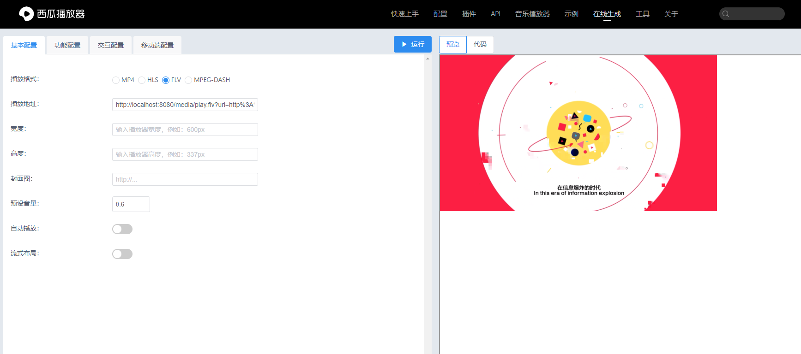

## 项目功能
实现java拉流播放，对一些网页h5不支持的播放格式进行代理播放，如想要播放http://xxx/test.m3u8,就直接用播放器播放如下链接即可：
http://localhost:8080/media/play.flv?url=http%3A%2F%2Fsf1-cdn-tos.huoshanstatic.com%2Fobj%2Fmedia-fe%2Fxgplayer_doc_video%2Fhls%2Fxgplayer-demo.m3u8
url参数是要播放的目标视频的urlencode之后的结果，已经测试过西瓜播放器，参考实例如下：
https://v2.h5player.bytedance.com/generate/
